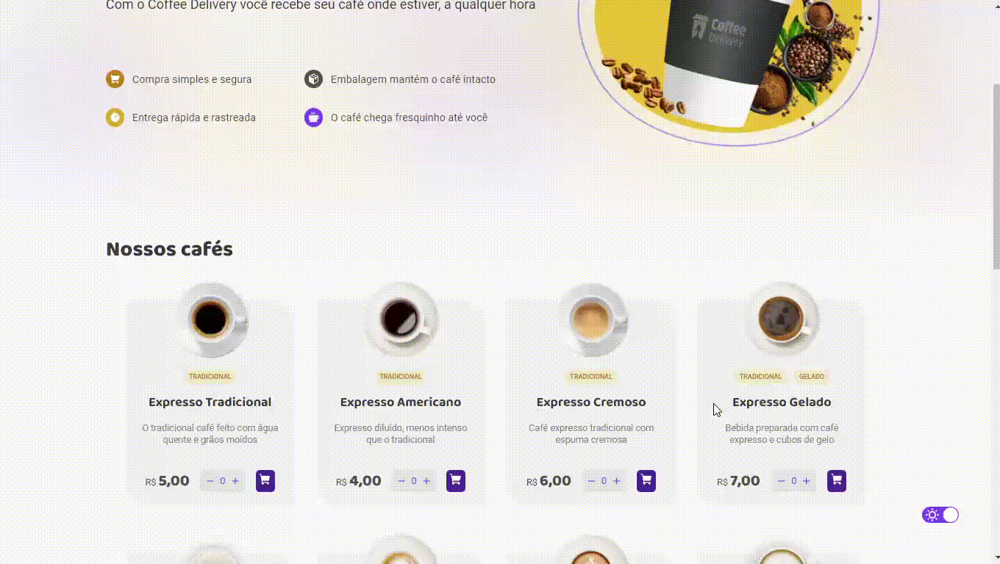
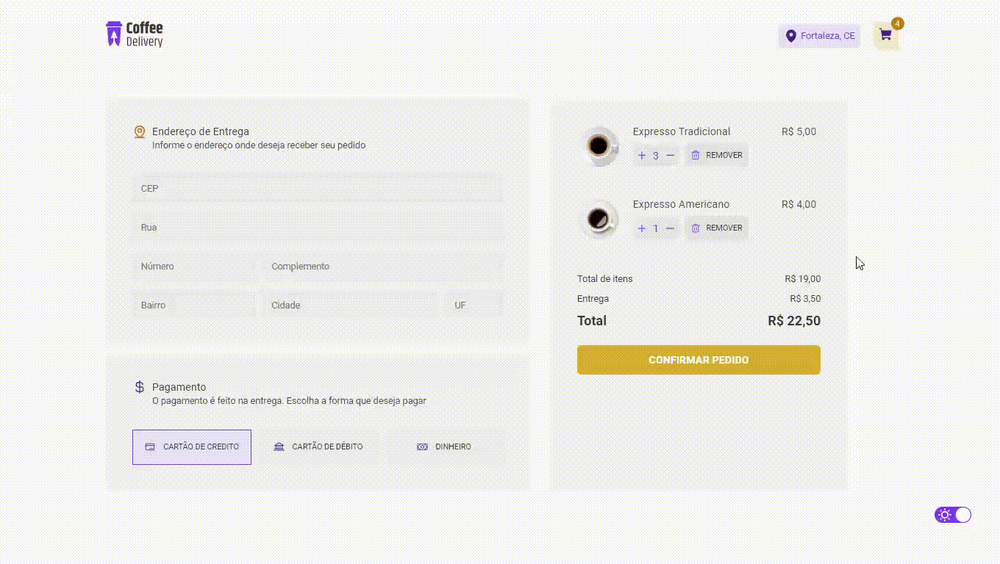

<h1 align="center">🥤 Coffee Delivery ☕</h1>

 

<h3 align="center">Um site de delivery de uma cafeteria desenvolvido com React + Typescript.</h3>

<h2>Demonstração 🎥</h2>

_<h3>Tour pelo projeto com o uso de temas</h3>_

_<h3>Adicionando e removendo cafés do carrinho 🛒</h3>_

_<h3>Finalizando Pedidos 📦</h3>_

 

<h2>Tecnologias Utilizadas 🛠</h2>

#### FrontEnd: `ReactJS!`

- React Icons
- React Hook Form
- Zod Resolver
- Typescript
- Context API
- React Router Dom

 
  
  
  
  
 

 
